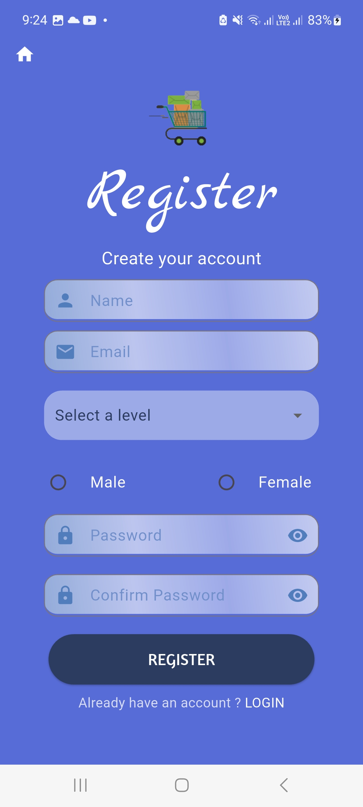

# 🍽️ Food Discovery App

A cross-platform mobile application for discovering nearby restaurants and cafés, browsing their menus, and navigating to them — built using **Flutter (Cubit + MVVM)** and **Spring Boot (Java)**.

## 📱 Screenshots

| Register | Login | Restaurant Page |
|---|---|---|
|  |  |  |

| Search Input | Search Results | Product Provider |
|---|---|---|
|  |  |  |

## 🚀 Features

- **Register/Login with validation** using JWT and email confirmation
- Browse restaurants and their product menus
- Search by product and see results in **list** and **map** views
- Tap a restaurant to get **distance and directions** from current location
- Backend built with **Spring Boot**, secured by **JWT**, integrated with location and product-based filtering

## 🧱 Tech Stack

- **Frontend**: Flutter, Cubit, MVVM, Dio, Google Maps, Geolocator
- **Backend**: Spring Boot, Java, Spring Security, JWT, REST APIs

## 🛠 How to Run

### Backend
```bash
cd backend/
mvn spring-boot:run
